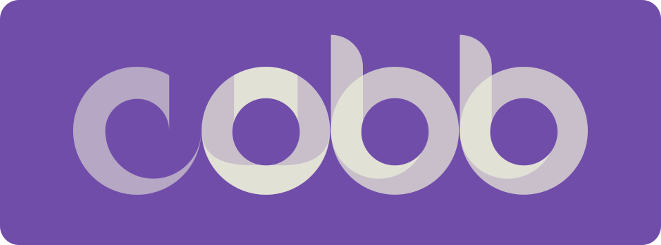

<h1 align="left" style="float: left;">Hello there! 👋</h1>

My name is Tom. I'm a full stack web developer.

### My skills

### About me

- ⚡ Fun fact: I got my start in sales/marketing. Looking to bring that customer-focused, user experience-driven mindset to the dev world!
- 🔭 I’m currently working on a shopping list generator for health-minded cooks looking to explore new recipes. Enter your dietary restrictions/calorie limit, choose your recipes for the week, and voila! You've got your self a shopping list.
- 🌱 I’m currently learning Javascript via Launch School. I already know enough Javascript, Node.JS, Express, etc. to build websites, but Launch School is a chance to go deeper and really become an expert in Javascript.
- 👯 I’d love to collab with anyone who has a design or visual arts background. With your design expertise and my experience in sales/marketing, we could make a killer web dev agency!
- 📫 How to reach me: tom@tomcobbcodes.com
<!-- - 🤔 I’m looking for help with -->
<!-- - 💬 Ask me about ... -->
